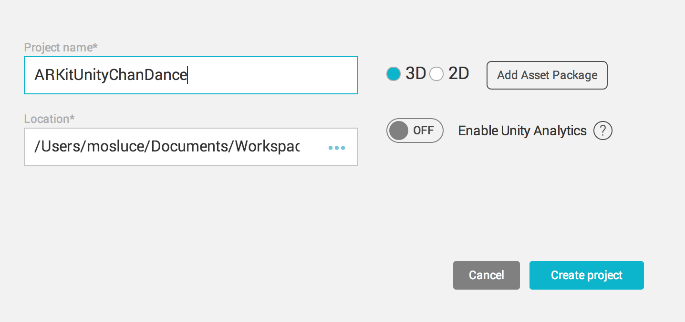
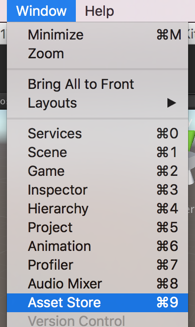
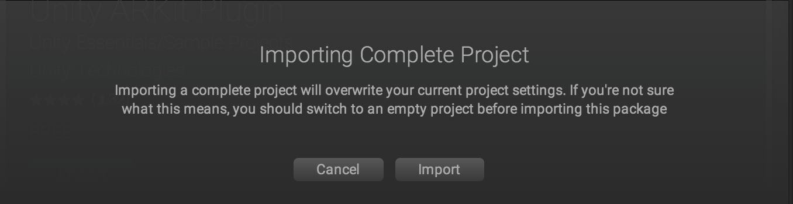
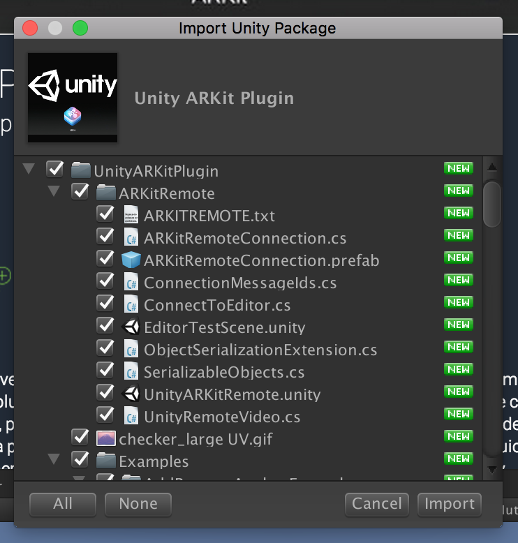
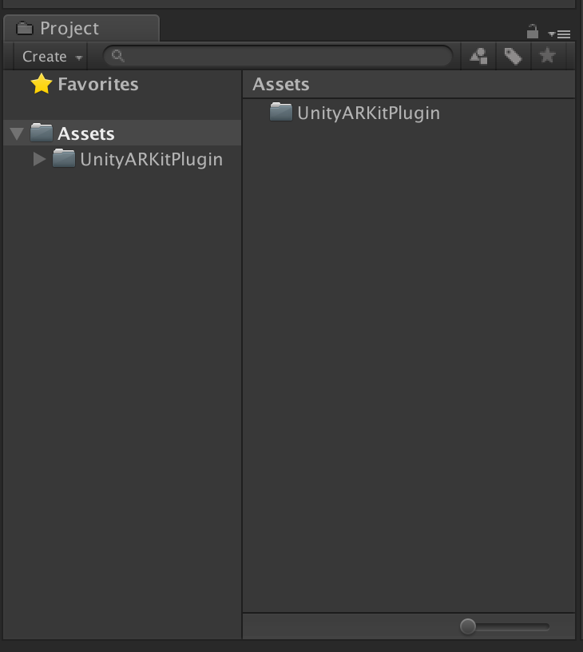

# 導入 ARKitPlugin

> 注意：導入 ARKitPlugin 會覆寫專案設定，進行中專案請小心服用

- 建立專案

- 打開 Asset Store

- 搜尋「arkit」

- 往下捲動可以看到下圖，點入

- 找到頁面中的「Import」(或 Download)，並點按

- Import

- Import

- 完成 Import 

> 下一步：[導入素材](/3.dao-ru-su-cai.md)
