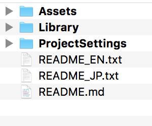
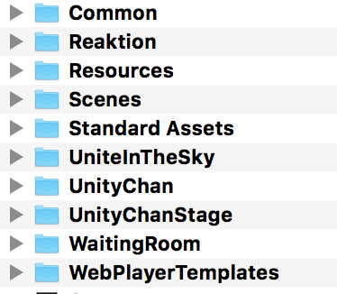
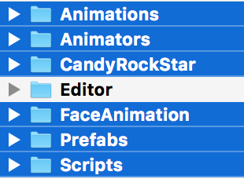
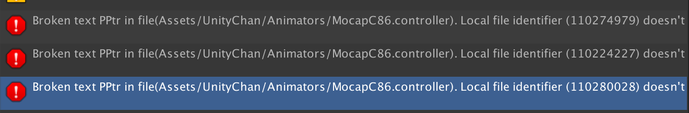
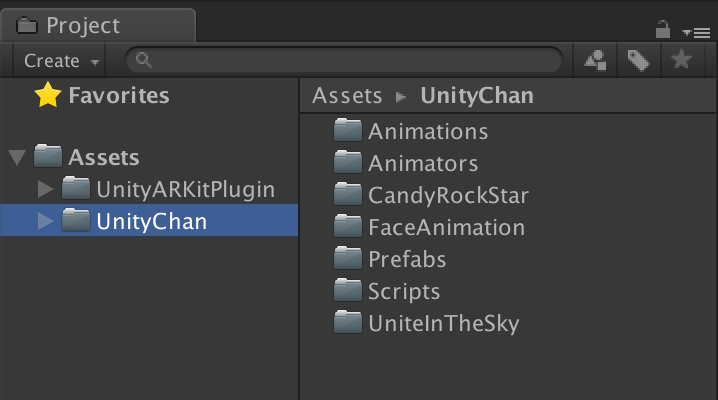

# 導入素材

1. 開啟[事前準備](/chapter1.md)中下載的素材包，資料夾結構如圖

  

2. 點進 Assets

  

3. 把 UniteInTheSky 資料夾複製到專案資料夾中的 Assets 中
4. 回到素材包，點入 UnityChan 資料夾，複製圖中顯示為藍色背景的資料夾專案資料夾的 Assets 中

  

5. 回到 Unity 等待資料轉換 
6. 轉換過程可能會發生錯誤，下圖錯誤可以忽略

  

7. 最後整理一下資料夾，建立一個 UnityChan 資料夾，把剛剛導入的素材收入其中

  

> 下一步：[開始 AR！](/4.kai-shi-ar.md)
