# 開始 AR！

- 打開下圖所示場景

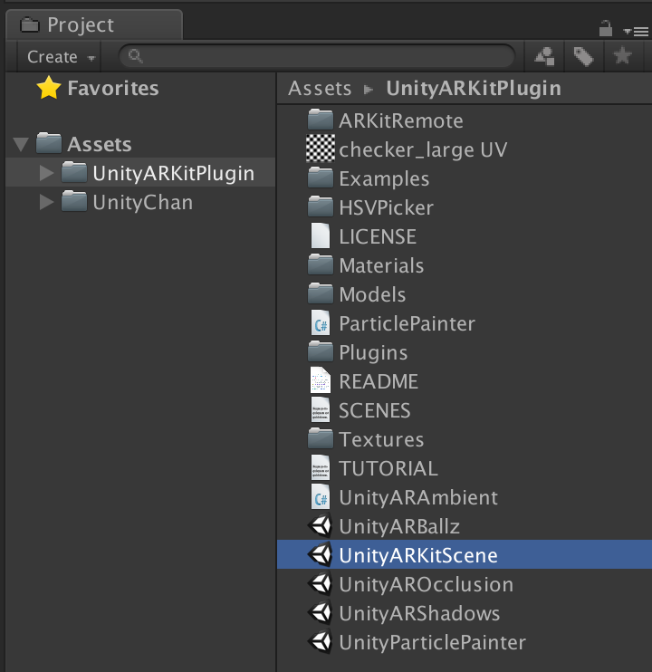

- Hierarchy 狀態

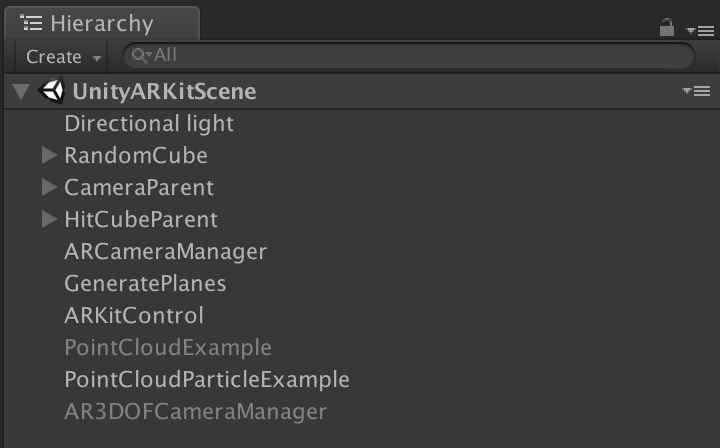

- 展開 HitCubeParent

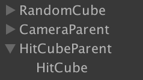

- 刪除 HitCube
- 將下圖 prefab 拖拉至 HitCube 的位置

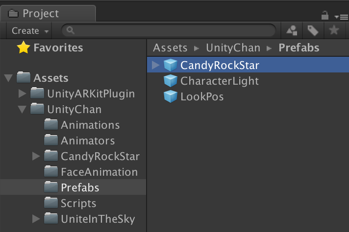

- Hierarchy 顯示如圖

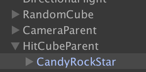

- 點選 Hierarchy 中的 CandyRockStar
- 並在 Inspector 最底下點擊 「Add Componenet」

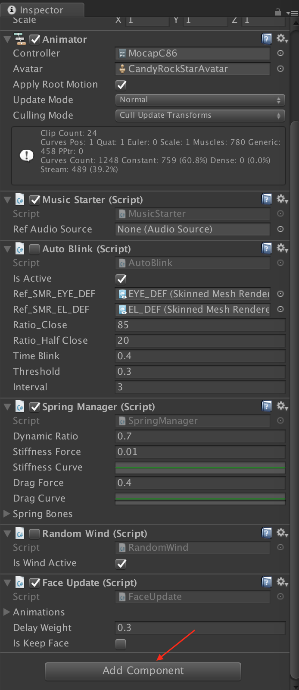

- 並輸入「hit」

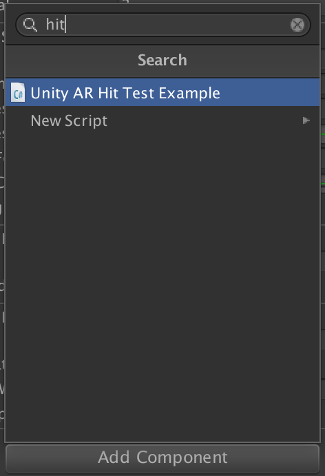

- 雙擊「Unity AR Hit Test Example」，下圖為加入成功狀態

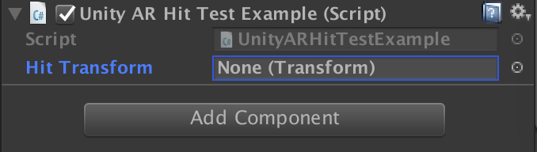

- 在 Hierarchy 中，拖拉「HitCubeParent」到上圖中的「Hit Transform」空位中

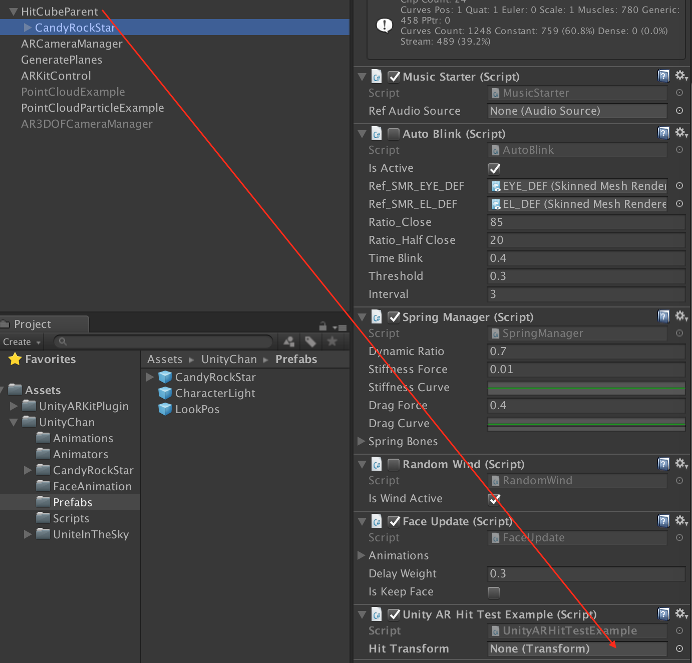

- 進入 Build Settings

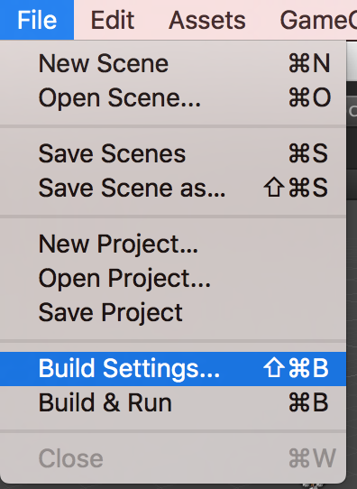

- 調整設定

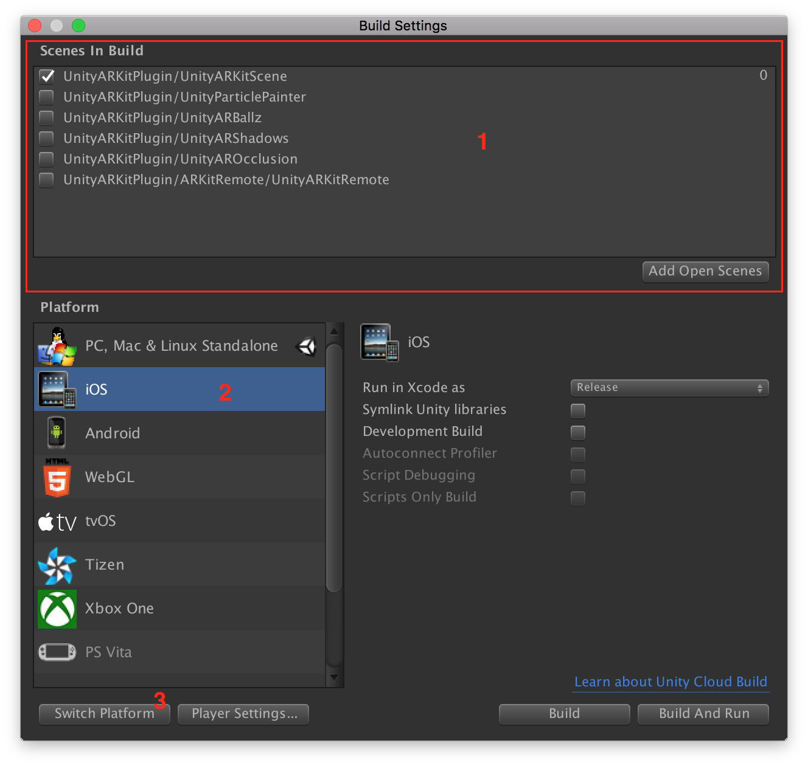

- 點按 Build And Run，然後...玩玩看

> 下一步：[Music！](/music.md)
